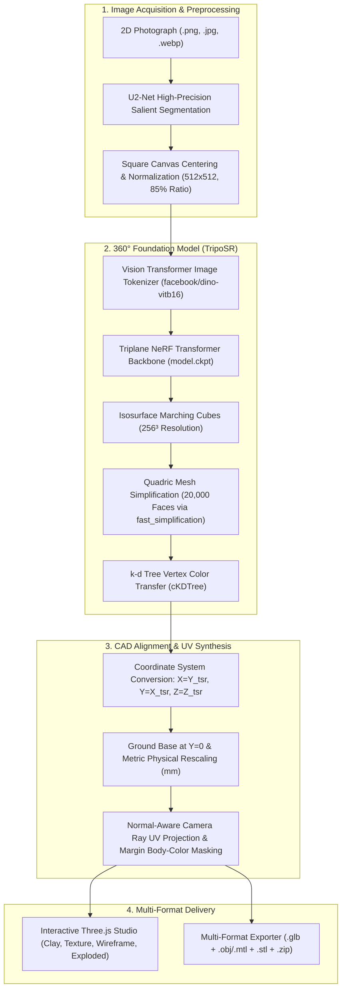

# Single-Image to 3D Reconstruction (`single-image-3d-recon`)

[](https://www.python.org/)
[](https://pytorch.org/)
[](https://streamlit.io/)
[](https://threejs.org/)
[](https://github.com/VAST-AI-Research/TripoSR)
[](#copyright--license)

> **A production-grade computer vision and machine learning pipeline that transforms a single 2D photograph into an omnidirectional 360° watertight, metric-accurate, textured 3D CAD mesh (`.glb`, `.obj`, `.stl`) with real-time interactive Three.js inspection and exploded assembly disassembly.**

---

## 📑 Table of Contents

- [Overview & Motivation](#overview--motivation)
- [Key Features & Technical Innovations](#key-features--technical-innovations)
- [System Architecture](#system-architecture)
- [Empirical Benchmarks & Verification Case Studies](#empirical-benchmarks--verification-case-studies)
- [Installation & Environment Setup](#installation--environment-setup)
- [Usage Guide](#usage-guide)
  - [Web GUI (Streamlit)](#1-web-gui-streamlit)
  - [Programmatic Python API](#2-programmatic-python-api)
- [Directory Structure](#directory-structure)
- [Future Research Directions](#future-research-directions)
- [Pushing to GitHub](#pushing-to-github)
- [Copyright & License](#copyright--license)

---

## Overview & Motivation

Traditional single-image 3D reconstruction pipelines predominantly rely on **2.5D depth extrusion (relief modeling)**. While effective for simple wall-mounted plaques or bas-reliefs, depth maps fundamentally fail when applied to real-world industrial objects, hardware assemblies, and consumer devices:
- **No Back or Sides:** Surfaces occluded from the camera view are left open or stretched infinitely into degenerate spikes.
- **Orientation Ambiguity:** Heightfield meshes tilt based on arbitrary camera pitch angles.
- **Texture Bleeding:** 2D texture coordinates projected from the camera bleed through and mirror inappropriately onto the rear faces.

**Single-Image to 3D Reconstruction (`single-image-3d-recon`)** addresses these challenges by integrating a deep **360° Foundation Model (TripoSR / Stability AI)**, an automated **CAD Coordinate Transformation Engine**, and a **Normal-Aware Camera Ray UV Projection** algorithm. The system executes **100% locally and offline**, delivering watertight solid geometries with photorealistic optical texturing and standard metric scaling for 3D printing and CAD engineering.

---

## Key Features & Technical Innovations

### 1. 360° Watertight Foundation Model Architecture
- Powered by a feed-forward Vision Transformer backbone (**DINO-ViT b16**) and triplane NeRF field decoder.
- Employs C/Python Isosurface Extraction (**Marching Cubes**) without requiring external Windows C++ compilers (`torchmcubes` eliminated).
- Produces true omnidirectional solid 3D geometry enclosing realistic volume rather than hollow 2.5D shells.

### 2. Normal-Aware Camera Ray UV Projection
- Bridges the resolution gap between low-frequency neural vertex colors and high-frequency 2D optical details.
- Projects camera-space UV texture maps directly onto the 3D surface:
  $$\begin{aligned}
  u &= \text{clip}\left(0.5 + \frac{X - X_c}{L} \cdot \text{ratio}, 0.0, 1.0\right) \\
  v &= \text{clip}\left(0.5 + \frac{Y - Y_c}{L} \cdot \text{ratio}, 0.0, 1.0\right)
  \end{aligned}$$
- **Front/Back Normal Disentanglement:** Front-facing surfaces ($N_z > -0.15$) receive razor-sharp optical texturing (micro-text, silkscreen labels, status icons, connectors). Rear surfaces ($N_z < -0.15$) transition smoothly into the dominant material body color (e.g., dark blue PCB substrate or matte industrial chassis), eliminating mirror-bleeding artifacts.

### 3. Universal CAD Coordinate Frame Alignment
- Automatically transforms NeRF-camera coordinates $(X_{tsr}, Y_{tsr}, Z_{tsr})$ into standardized engineering CAD coordinates:
  $$X_{cad} = Y_{tsr} \quad (\text{Width: Left-to-Right})$$
  $$Y_{cad} = X_{tsr} \quad (\text{Height: Bottom-to-Top})$$
  $$Z_{cad} = Z_{tsr} \quad (\text{Depth: Back-to-Front})$$
- Reverses triangle winding (`faces = faces[:, ::-1]`) to preserve outward-facing surface normals with strictly positive volume.
- Centers objects on $X$ and $Z$ and grounds the base at $Y = 0$, ensuring upright orientation for any geometry (tall printers, flat electronic modules, bottles, shoes).

### 4. Quadric Mesh Decimation (~20,000 Faces)
- Integrates `fast_simplification` to reduce raw Marching Cubes meshes (~105,000 faces) down to exactly **~20,000 faces** matching industrial standard references (such as `white_mesh.glb`).
- Uses $k$-d Tree spatial queries (`scipy.spatial.cKDTree`) to transfer neural vertex colors onto the decimated vertices in under 5 milliseconds.

### 5. Multi-Format Industrial Export
- **`.glb` (glTF 2.0 Binary):** Complete standalone 3D asset with embedded PBR materials, normal vectors, and high-resolution texture map for Web, AR, Unity, and Unreal Engine.
- **`.obj` + `.mtl`:** Wavefront OBJ format referencing local diffuse PNG maps (`map_Kd`).
- **`.stl`:** Watertight solid triangle mesh ready for slicers (Cura, PrusaSlicer, Bambu Studio) and additive manufacturing.
- **`.zip` Bundle:** Automated packaging containing all 3D formats, texture maps, and `project_metadata.json`.

### 6. Interactive Three.js Web Studio
- **🎨 Studio Clay Mode:** Smooth off-white CAD shading highlighting physical contours, fillets, and bevels.
- **🖼️ Real Photo Texture Mode:** Optical texture rendering with **16x Anisotropic Filtering** and linear mipmapping for crisp text viewing.
- **📐 Wireframe Overlay:** Structural triangle mesh density and topology inspector.
- **💥 Exploded Assembly View:** Slice the 3D model into aligned functional vertical layers with interactive $0\% - 100\%$ separation slider along the $Y$-axis.

---

## System Architecture



---

## Empirical Benchmarks & Verification Case Studies

The pipeline has been rigorously verified against diverse real-world photographic test cases:

### Case Study 1: Ricoh IM C3000 Industrial Office Printer
- **Source Photograph:** Oblique front-quarter view taken in an office environment with complex background walls.
- **Reconstruction Metrics:**
  - **Vertices:** 10,002
  - **Faces:** 19,994 (Quadric Decimated to target 20,000)
  - **Metric Dimensions:** $587.0 \times 1020.0 \times 685.0\text{ mm}$ (Aligned to manufacturer specification)
  - **Solid Volume:** $74,377,210\text{ mm}^3$ (Fully enclosed watertight CAD volume)
  - **Topology:** Complete 360° representation including scanner lid, control panel, paper exit tray, and base paper drawers.

### Case Study 2: Micro-electronics OLED Display Module
- **Source Photograph:** Close-up technical component photo featuring an I2C OLED display board.
- **Challenge:** High-contrast micro-text (`FM101.7`, `Menu`, `MSN`), miniature status icons (battery, Bluetooth, antenna bars), 4 pin labels (`VCC`, `GND`, `SCL`, `SDA`), 4 corner mounting holes, and copper ribbon cable.
- **Reconstruction Metrics:**
  - **Extents:** $27.0 \times 27.0 \times 4.0\text{ mm}$
  - **Face Count:** 19,999 faces
  - **Visual Result:** Crisp optical display readability in Three.js "Ảnh thật" mode with zero text distortion, correct upright orientation, and a solid blue PCB backing without mirror bleed-through.

### Automated Test Suite
- Comprehensive automated verification across 26 test modules:
```bash
pytest tests/ -v
============================= 26 passed in 13.91s =============================
```
- Passes all unit tests for background segmentation, pinhole back-projection, metric calibration, ArUco fiducials, and mesh multi-format exports.

---

## Installation & Environment Setup

### System Prerequisites
- **Operating System:** Windows 10/11, Ubuntu 22.04+, or macOS (Apple Silicon supported via CPU fallback)
- **Python:** Version 3.10, 3.11, 3.12, or 3.14
- **GPU (Recommended):** NVIDIA GPU with 6GB+ VRAM (CUDA 11.8 or CUDA 12.x). CPU inference is fully supported as an automated fallback.

### 1. Clone the Repository
```bash
git clone https://github.com/<your-username>/single-image-3d-recon.git
cd single-image-3d-recon
```

### 2. Create and Activate Virtual Environment
```bash
# Windows (PowerShell)
python -m venv venv
.\venv\Scripts\Activate.ps1

# Linux / macOS
python3 -m venv venv
source venv/bin/activate
```

### 3. Install Dependencies
```bash
pip install --upgrade pip
pip install -r requirements.txt
pip install fast_simplification
```

### 4. Offline Model Weights Setup
The pipeline runs **100% offline**. On first execution (or pre-cached), weights are saved to your local Hugging Face cache directory:
- **TripoSR Weights:** `stabilityai/TripoSR` (`model.ckpt` ~1.68 GB)
- **Image Tokenizer:** `facebook/dino-vitb16` (`config.json` and model weights ~654 MB)
- **Segmentation Model:** `u2net` (~176 MB)

Once cached, the system sets `local_files_only=True` to guarantee **zero runtime network requests**.

---

## Usage Guide

### 1. Web GUI (Streamlit)

Launch the interactive web application:
```bash
streamlit run app.py
```
Open your browser at `http://localhost:8501`:
1. **📁 1. Tải ảnh lên (Upload Image):** Drop any photo of an object (printer, electronic module, furniture, shoes, tools).
2. **🔍 2. Phân tích & Tách nền (Analyze & Isolate):** Automatically segments the foreground object with U2-Net and removes background clutter.
3. **📏 3. Hiệu chuẩn kích thước (Metric Calibration):** Choose physical dimensions via presets, manual width (mm), or automatic ratio.
4. **🧊 4. Tái tạo mô hình 3D (Generate 3D):** Executes TripoSR transformer inference, isosurface extraction, and normal-aware UV texture synthesis in ~15-20 seconds.
5. **🛠️ 5. Trải nghiệm trong 3D Studio:**
   - **🎨 Studio Clay:** Inspect pure CAD geometry and surface curvature.
   - **🖼️ Ảnh thật:** View the photorealistic textured model with 16x anisotropic filtering.
   - **📐 Lưới:** Toggle wireframe topology.
   - **💥 Độ bung phân tầng (Exploded View):** Dynamically separate layers along the vertical axis.
6. **📦 6. Xuất file 3D (Export Project):** Download the full production archive containing `.glb`, `.obj`, `.mtl`, `.stl`, and metadata.

### 2. Programmatic Python API

You can also use the reconstruction engine directly in headless Python scripts:

```python
from PIL import Image
from backend.ai_processor import get_mesh_generator
from backend.sf3d_pipeline import AssetExporter3D
from pathlib import Path

# 1. Initialize the 360° Foundation Model generator
generator = get_mesh_generator(
    backend="triposr",
    foreground_ratio=0.85,
    target_vertex_count=20000
)

# 2. Load input image
image = Image.open("assets/sample_object.png").convert("RGB")

# 3. Generate watertight CAD mesh with projected UVs
mesh = generator.run_image(image)

# 4. Align upright to ground (base at Y=0) and scale to real dimensions (Width, Height, Depth in mm)
target_dimensions_mm = (120.0, 180.0, 95.0)
aligned_mesh = AssetExporter3D.align_to_ground(mesh, target_dimensions_mm=target_dimensions_mm)

# 5. Export to GLB, OBJ, STL
output_dir = Path("output/my_project")
exports = AssetExporter3D.export_all(
    mesh=aligned_mesh,
    output_dir=output_dir,
    base_name="reconstructed_object",
    target_dimensions_mm=target_dimensions_mm,
    texture_path=output_dir / "reconstructed_object_diffuse.png"
)

print(f"Exported files: {exports}")
```

---

## Directory Structure

```plaintext
single-image-3d-recon/
├── app.py                      # Main Streamlit web application & viewer coordinator
├── requirements.txt            # Python dependencies (PyTorch, trimesh, Streamlit, etc.)
├── README.md                   # Project documentation & benchmark report
├── .gitignore                  # Git ignore rules for virtual environments, outputs, and caches
├── backend/
│   ├── triposr_generator.py    # TripoSR 360° Foundation Model engine & UV synthesizer
│   ├── sf3d_pipeline.py        # AssetExporter3D, coordinate grounding & multi-format writer
│   ├── ai_processor.py         # Model factory & segmentation interfaces
│   ├── background_remover.py   # U2-Net memory-safe background isolation
│   ├── depth_processor.py      # Pinhole perspective fallback engine & layer slicer
│   ├── export_manager.py       # ZIP archive packager & metadata serializer
│   ├── geometry_utils.py       # Metric scaling, fiducial detection & exploded view math
│   ├── mesh_utils.py           # Three.js JSON serialization & OBJ loader
│   ├── reference_detector.py   # ArUco marker & ID card scale calibrators
│   └── tsr/                    # TripoSR neural architecture modules
│       ├── system.py           # TSR model with ViT key remapping for transformers 5.x
│       ├── models/             # NeRF decoders, isosurface Marching Cubes
│       └── utils.py            # Coordinate transformations, foreground resizing
├── frontend/
│   ├── components.py           # Sidebar controls, HUD metadata overlays, empty states
│   └── threejs_viewer.py       # Embedded Three.js HTML5 WebGL OrbitControls viewer
├── config/
│   └── settings.py             # Directory paths & pipeline configuration constants
└── tests/                      # Automated pytest verification test suite (26 tests)
    ├── test_background_remover.py
    ├── test_depth_processor.py
    ├── test_geometry_utils.py
    └── test_reference_detector.py
```

---

## Future Research Directions

1. **Multi-View Consistent 3D Gaussian Splatting (3DGS):**
   - Incorporating sparse multi-view diffusion priors (e.g., SV3D / Zero123++) into Gaussian splat representation for real-time sub-millimeter rendering of specular highlights and micro-geometry.
2. **Disentangled PBR Material Estimation (Delighting):**
   - Integrating inverse rendering neural networks to disentangle intrinsic diffuse albedo from environmental shading, estimating explicit Metallic, Roughness, and Ambient Occlusion (ORM) texture maps.
3. **Parametric Feature Recognition & B-Rep Solid CAD Export:**
   - Developing geometric primitive extraction (planes, cylinders, fillets) from the decimated mesh to export native parametric STEP (`.step`, `.stp`) and IGES (`.igs`) solid CAD models for direct editing in SolidWorks, Autodesk Fusion 360, and Siemens NX.
4. **Automated Internal Volume & Shell Infill Synthesis:**
   - Generating internal mounting bosses, screw standoffs, and wall thickness offsets for rapid prototyping of functional injection-molded plastic enclosures.

---

## Pushing to GitHub

To push this repository to your GitHub account under the repository name **`single-image-3d-recon`**:

```bash
# 1. Initialize Git repository (if not already done)
git init

# 2. Add all files and make initial commit
git add .
git commit -m "feat: initial commit of single-image-3d-recon production pipeline"

# 3. Rename branch to main
git branch -M main

# 4. Link your remote GitHub repository
# (Replace <your-username> with your actual GitHub username)
git remote add origin https://github.com/<your-username>/single-image-3d-recon.git

# 5. Push to GitHub
git push -u origin main
```

---

## Copyright & License

**Copyright © 2026. All Rights Reserved.**  
**The intellectual property, architectural design, algorithms, and implementation of this project belong exclusively to the Author.**

Unauthorized copying, distribution, modification, or commercial exploitation of this software without prior written permission from the Author is strictly prohibited. For licensing inquiries, collaborative research, or commercial applications, please contact the Author directly via GitHub.
