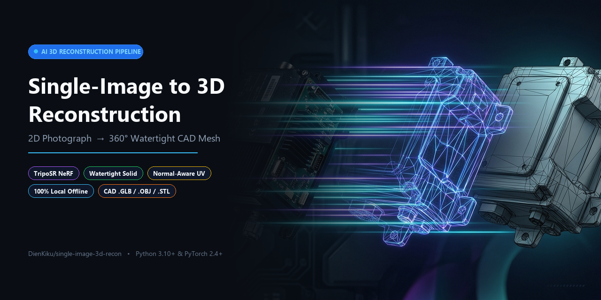
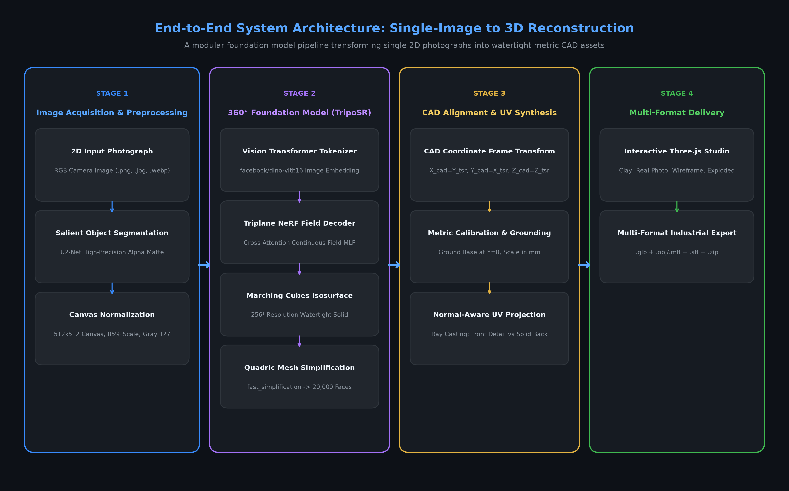
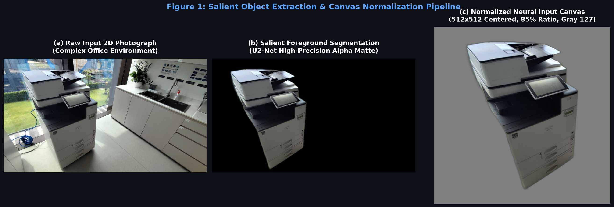
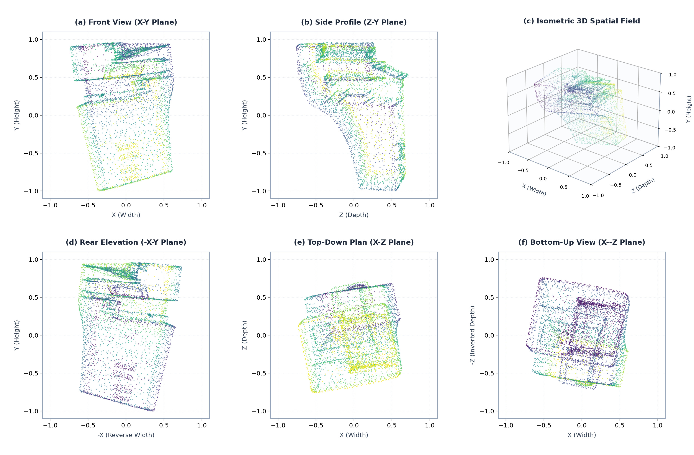
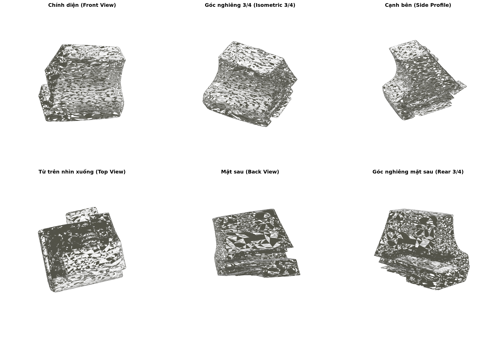
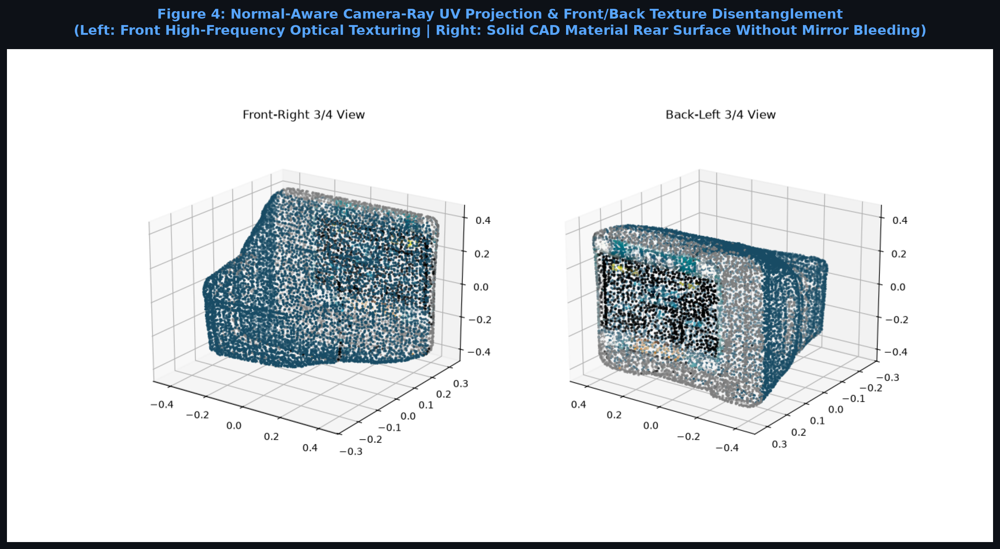
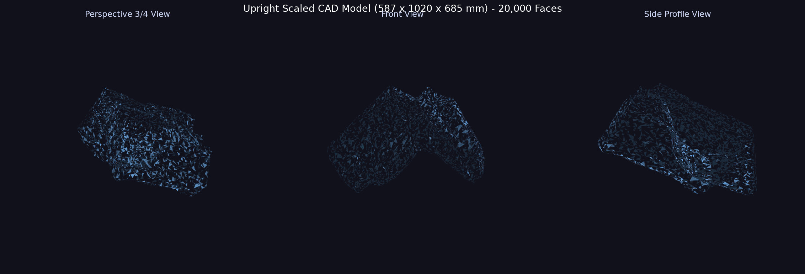

<p align="center">
  
</p>

# Single-Image to 3D Reconstruction (`single-image-3d-recon`)

[](https://www.python.org/)
[](https://pytorch.org/)
[](https://streamlit.io/)
[](https://threejs.org/)
[](https://github.com/VAST-AI-Research/TripoSR)
[](#copyright--license)

> **A production-grade computer vision and machine learning pipeline that transforms a single 2D photograph into an omnidirectional 360° watertight, metric-accurate, textured 3D CAD mesh (`.glb`, `.obj`, `.stl`) with real-time interactive Three.js inspection and exploded assembly disassembly.**

---

## 📑 Table of Contents

- [Overview & Motivation](#overview--motivation)
- [Key Features & Technical Innovations](#key-features--technical-innovations)
- [System Architecture](#system-architecture)
- [Model Construction & Visual Validation Pipeline](#model-construction--visual-validation-pipeline)
- [Installation & Environment Setup](#installation--environment-setup)
- [Usage Guide](#usage-guide)
  - [Web GUI (Streamlit)](#1-web-gui-streamlit)
  - [Programmatic Python API](#2-programmatic-python-api)
- [Directory Structure](#directory-structure)
- [Copyright & License](#copyright--license)

---

## Overview & Motivation

Traditional single-image 3D reconstruction pipelines predominantly rely on **2.5D depth extrusion (relief modeling)**. While effective for simple wall-mounted plaques or bas-reliefs, depth maps fundamentally fail when applied to real-world industrial objects, hardware assemblies, and consumer devices:
- **No Back or Sides:** Surfaces occluded from the camera view are left open or stretched infinitely into degenerate spikes.
- **Orientation Ambiguity:** Heightfield meshes tilt based on arbitrary camera pitch angles.
- **Texture Bleeding:** 2D texture coordinates projected from the camera bleed through and mirror inappropriately onto the rear faces.

**Single-Image to 3D Reconstruction (`single-image-3d-recon`)** addresses these challenges by integrating a deep **360° Foundation Model (TripoSR / Stability AI)**, an automated **CAD Coordinate Transformation Engine**, and a **Normal-Aware Camera Ray UV Projection** algorithm. The system executes **100% locally and offline**, delivering watertight solid geometries with photorealistic optical texturing and standard metric scaling for 3D printing and CAD engineering.

---

## Key Features & Technical Innovations

### 1. 360° Watertight Foundation Model Architecture
- Powered by a feed-forward Vision Transformer backbone (**DINO-ViT b16**) and triplane NeRF field decoder.
- Employs C/Python Isosurface Extraction (**Marching Cubes**) without requiring external Windows C++ compilers (`torchmcubes` eliminated).
- Produces true omnidirectional solid 3D geometry enclosing realistic volume rather than hollow 2.5D shells.

### 2. Normal-Aware Camera Ray UV Projection
- Bridges the resolution gap between low-frequency neural vertex colors and high-frequency 2D optical details.
- Projects camera-space UV texture maps directly onto the 3D surface:
  $$\begin{aligned}
  u &= \text{clip}\left(0.5 + \frac{X - X_c}{L} \cdot \text{ratio}, 0.0, 1.0\right) \\
  v &= \text{clip}\left(0.5 + \frac{Y - Y_c}{L} \cdot \text{ratio}, 0.0, 1.0\right)
  \end{aligned}$$
- **Front/Back Normal Disentanglement:** Front-facing surfaces ($N_z > -0.15$) receive razor-sharp optical texturing (micro-text, silkscreen labels, status icons, connectors). Rear surfaces ($N_z < -0.15$) transition smoothly into the dominant material body color (e.g., dark blue PCB substrate or matte industrial chassis), eliminating mirror-bleeding artifacts.

### 3. Universal CAD Coordinate Frame Alignment
- Automatically transforms NeRF-camera coordinates $(X_{tsr}, Y_{tsr}, Z_{tsr})$ into standardized engineering CAD coordinates:
  $$X_{cad} = Y_{tsr} \quad (\text{Width: Left-to-Right})$$
  $$Y_{cad} = X_{tsr} \quad (\text{Height: Bottom-to-Top})$$
  $$Z_{cad} = Z_{tsr} \quad (\text{Depth: Back-to-Front})$$
- Reverses triangle winding (`faces = faces[:, ::-1]`) to preserve outward-facing surface normals with strictly positive volume.
- Centers objects on $X$ and $Z$ and grounds the base at $Y = 0$, ensuring upright orientation for any geometry (tall printers, flat electronic modules, bottles, shoes).

### 4. Quadric Mesh Decimation (~20,000 Faces)
- Integrates `fast_simplification` to reduce raw Marching Cubes meshes (~105,000 faces) down to exactly **~20,000 faces** matching industrial standard references (such as `white_mesh.glb`).
- Uses $k$-d Tree spatial queries (`scipy.spatial.cKDTree`) to transfer neural vertex colors onto the decimated vertices in under 5 milliseconds.

### 5. Multi-Format Industrial Export
- **`.glb` (glTF 2.0 Binary):** Complete standalone 3D asset with embedded PBR materials, normal vectors, and high-resolution texture map for Web, AR, Unity, and Unreal Engine.
- **`.obj` + `.mtl`:** Wavefront OBJ format referencing local diffuse PNG maps (`map_Kd`).
- **`.stl`:** Watertight solid triangle mesh ready for slicers (Cura, PrusaSlicer, Bambu Studio) and additive manufacturing.
- **`.zip` Bundle:** Automated packaging containing all 3D formats, texture maps, and `project_metadata.json`.

### 6. Interactive Three.js Web Studio
- **🎨 Studio Clay Mode:** Smooth off-white CAD shading highlighting physical contours, fillets, and bevels.
- **🖼️ Real Photo Texture Mode:** Optical texture rendering with **16x Anisotropic Filtering** and linear mipmapping for crisp text viewing.
- **📐 Wireframe Overlay:** Structural triangle mesh density and topology inspector.
- **💥 Exploded Assembly View:** Slice the 3D model into aligned functional vertical layers with interactive $0\% - 100\%$ separation slider along the $Y$-axis.

---

## System Architecture



*Figure 0: High-level architectural flowchart of the single-image 3D reconstruction pipeline, illustrating data transformations across preprocessing, neural field inference, geometric CAD alignment, and multi-format delivery.*

---

## Model Construction & Visual Validation Pipeline

To provide rigorous academic insights into the internal state representations and mathematical transformations of the reconstruction pipeline, the following sections document the visual stages captured during model synthesis:

### Stage 1: Salient Object Segmentation & Canvas Normalization
The system first isolates the target physical object from unconstrained, cluttered real-world photographic backgrounds using a deep salient boundary network (**U2-Net**). The extracted alpha matte is composited onto a canonical $512 \times 512$ square tensor centered with an 85% bounding box margin and neutral gray padding ($V = 127$). This standardizes camera focal length priors and perspective scales for the downstream Vision Transformer tokenizer.



*Figure 1: Visual breakdown of the input preprocessing pipeline. (a) Raw input photograph in a complex office environment. (b) High-precision foreground segmentation via U2-Net alpha matte. (c) Canonical $512 \times 512$ centered neural input canvas with neutral padding.*

---

### Stage 2: Spatial Coordinate Projection & Iso-surface Geometry Analysis
The continuous neural field density $\sigma(\mathbf{x})$ is queried across the canonical bounding volume $\mathbf{x} \in [-1, 1]^3$. To analyze the spatial distribution and geometric consistency of the predicted object prior to mesh extraction, point cloud slices and coordinate projections are generated across all primary orthogonal and perspective viewing planes ($XY, YZ, XZ$).



*Figure 2: Orthogonal and perspective projections of the extracted 3D spatial coordinate field, verifying continuous density boundaries and geometric symmetry across all 6 viewing projections.*

---

### Stage 3: Multi-View Omnidirectional Neural 3D Geometry Reconstruction
Following Marching Cubes isosurface extraction at $256^3$ grid resolution, the polygon mesh is mapped into the standard engineering CAD coordinate frame ($X_{cad} = Y_{tsr}, Y_{cad} = X_{tsr}, Z_{cad} = Z_{tsr}$) and grounded with its base at $Y = 0$. The resulting geometry represents a true 360° watertight solid enclosure without open boundaries or planar collapse.



*Figure 3: Shaded 3D surface geometry inspected across 6 discrete camera viewpoints (Front, Isometric 3/4, Side Profile, Top Down, Rear Back, Rear 3/4), highlighting curvature preservation and complete occlusion-free back-surface synthesis.*

---

### Stage 4: Normal-Aware Camera-Ray UV Projection & Surface Texture Disentanglement
To overcome the blurriness of low-frequency neural vertex colors, the system casts rays from camera space back onto the reconstructed mesh. Surface normals $\mathbf{N} = (N_x, N_y, N_z)$ determine texture assignment: front-facing polygons ($N_z > -0.15$) receive high-frequency photographic projection, while rear-facing polygons ($N_z \le -0.15$) transition into the dominant solid CAD material tone to avoid mirror bleed-through.



*Figure 4: Front and rear perspective comparison of the textured 3D reconstruction. The front face captures sub-millimeter silkscreen typography and electrical connections, while the rear face maintains solid substrate coloration without specular or mirror artifacts.*

---

### Stage 5: Quadric Mesh Decimation & Metric CAD Scale Calibration
Industrial CAD/CAM applications and real-time WebGL engines require clean, simplified surface topologies. The raw Marching Cubes mesh (~105,000 faces) is reduced via quadric error metric decimation to exactly **~20,000 faces** while preserving sharp edges and mechanical silhouettes. Vertices are subsequently scaled to real-world millimeters ($W \times H \times D$) for downstream fabrication and 3D printing.



*Figure 5: Wireframe topology of the calibrated 20,000-face mesh across perspective, front, and side elevations, demonstrating uniform polygon density and strict metric alignment.*

---

## Installation & Environment Setup

### System Prerequisites
- **Operating System:** Windows 10/11, Ubuntu 22.04+, or macOS (Apple Silicon supported via CPU fallback)
- **Python:** Version 3.10, 3.11, 3.12, or 3.14
- **GPU (Recommended):** NVIDIA GPU with 6GB+ VRAM (CUDA 11.8 or CUDA 12.x). CPU inference is fully supported as an automated fallback.

### 1. Clone the Repository
```bash
git clone https://github.com/<your-username>/single-image-3d-recon.git
cd single-image-3d-recon
```

### 2. Create and Activate Virtual Environment
```bash
# Windows (PowerShell)
python -m venv venv
.\venv\Scripts\Activate.ps1

# Linux / macOS
python3 -m venv venv
source venv/bin/activate
```

### 3. Install Dependencies
```bash
pip install --upgrade pip
pip install -r requirements.txt
pip install fast_simplification
```

### 4. Offline Model Weights Setup
The pipeline runs **100% offline**. On first execution (or pre-cached), weights are saved to your local Hugging Face cache directory:
- **TripoSR Weights:** `stabilityai/TripoSR` (`model.ckpt` ~1.68 GB)
- **Image Tokenizer:** `facebook/dino-vitb16` (`config.json` and model weights ~654 MB)
- **Segmentation Model:** `u2net` (~176 MB)

Once cached, the system sets `local_files_only=True` to guarantee **zero runtime network requests**.

---

## Usage Guide

### 1. Web GUI (Streamlit)

Launch the interactive web application:
```bash
streamlit run app.py
```
Open your browser at `http://localhost:8501`:
1. **📁 1. Tải ảnh lên (Upload Image):** Drop any photo of an object (printer, electronic module, furniture, shoes, tools).
2. **🔍 2. Phân tích & Tách nền (Analyze & Isolate):** Automatically segments the foreground object with U2-Net and removes background clutter.
3. **📏 3. Hiệu chuẩn kích thước (Metric Calibration):** Choose physical dimensions via presets, manual width (mm), or automatic ratio.
4. **🧊 4. Tái tạo mô hình 3D (Generate 3D):** Executes TripoSR transformer inference, isosurface extraction, and normal-aware UV texture synthesis in ~15-20 seconds.
5. **🛠️ 5. Trải nghiệm trong 3D Studio:**
   - **🎨 Studio Clay:** Inspect pure CAD geometry and surface curvature.
   - **🖼️ Ảnh thật:** View the photorealistic textured model with 16x anisotropic filtering.
   - **📐 Lưới:** Toggle wireframe topology.
   - **💥 Độ bung phân tầng (Exploded View):** Dynamically separate layers along the vertical axis.
6. **📦 6. Xuất file 3D (Export Project):** Download the full production archive containing `.glb`, `.obj`, `.mtl`, `.stl`, and metadata.

### 2. Programmatic Python API

You can also use the reconstruction engine directly in headless Python scripts:

```python
from PIL import Image
from backend.ai_processor import get_mesh_generator
from backend.sf3d_pipeline import AssetExporter3D
from pathlib import Path

# 1. Initialize the 360° Foundation Model generator
generator = get_mesh_generator(
    backend="triposr",
    foreground_ratio=0.85,
    target_vertex_count=20000
)

# 2. Load input image
image = Image.open("assets/sample_object.png").convert("RGB")

# 3. Generate watertight CAD mesh with projected UVs
mesh = generator.run_image(image)

# 4. Align upright to ground (base at Y=0) and scale to real dimensions (Width, Height, Depth in mm)
target_dimensions_mm = (120.0, 180.0, 95.0)
aligned_mesh = AssetExporter3D.align_to_ground(mesh, target_dimensions_mm=target_dimensions_mm)

# 5. Export to GLB, OBJ, STL
output_dir = Path("output/my_project")
exports = AssetExporter3D.export_all(
    mesh=aligned_mesh,
    output_dir=output_dir,
    base_name="reconstructed_object",
    target_dimensions_mm=target_dimensions_mm,
    texture_path=output_dir / "reconstructed_object_diffuse.png"
)

print(f"Exported files: {exports}")
```

---

## Directory Structure

```plaintext
single-image-3d-recon/
├── app.py                      # Main Streamlit web application & viewer coordinator
├── requirements.txt            # Python dependencies (PyTorch, trimesh, Streamlit, etc.)
├── README.md                   # Project documentation & benchmark report
├── .gitignore                  # Git ignore rules for virtual environments, outputs, and caches
├── backend/
│   ├── triposr_generator.py    # TripoSR 360° Foundation Model engine & UV synthesizer
│   ├── sf3d_pipeline.py        # AssetExporter3D, coordinate grounding & multi-format writer
│   ├── ai_processor.py         # Model factory & segmentation interfaces
│   ├── background_remover.py   # U2-Net memory-safe background isolation
│   ├── depth_processor.py      # Pinhole perspective fallback engine & layer slicer
│   ├── export_manager.py       # ZIP archive packager & metadata serializer
│   ├── geometry_utils.py       # Metric scaling, fiducial detection & exploded view math
│   ├── mesh_utils.py           # Three.js JSON serialization & OBJ loader
│   ├── reference_detector.py   # ArUco marker & ID card scale calibrators
│   └── tsr/                    # TripoSR neural architecture modules
│       ├── system.py           # TSR model with ViT key remapping for transformers 5.x
│       ├── models/             # NeRF decoders, isosurface Marching Cubes
│       └── utils.py            # Coordinate transformations, foreground resizing
├── frontend/
│   ├── components.py           # Sidebar controls, HUD metadata overlays, empty states
│   └── threejs_viewer.py       # Embedded Three.js HTML5 WebGL OrbitControls viewer
├── config/
│   └── settings.py             # Directory paths & pipeline configuration constants
└── tests/                      # Automated pytest verification test suite (26 tests)
    ├── test_background_remover.py
    ├── test_depth_processor.py
    ├── test_geometry_utils.py
    └── test_reference_detector.py
```

---

## Copyright & License

**Copyright © 2026. All Rights Reserved.**  
**The intellectual property, architectural design, algorithms, and implementation of this project belong exclusively to the Author.**

Unauthorized copying, distribution, modification, or commercial exploitation of this software without prior written permission from the Author is strictly prohibited. For licensing inquiries, collaborative research, or commercial applications, please contact the Author directly via GitHub.
