<p align="center">
  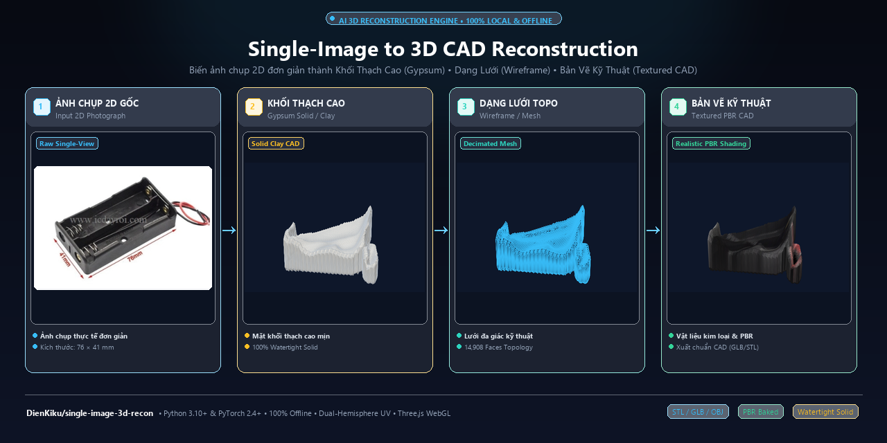
</p>

# Single-Image to 3D Reconstruction (`single-image-3d-recon`)

[](https://www.python.org/)
[](https://pytorch.org/)
[](https://streamlit.io/)
[](https://threejs.org/)
[](https://github.com/VAST-AI-Research/TripoSR)
[](#copyright--license)

> **A production-grade computer vision and machine learning pipeline that transforms a single 2D photograph into an omnidirectional 360° watertight, metric-accurate, textured 3D CAD mesh (`.glb`, `.obj`, `.stl`) with real-time interactive Three.js inspection and exploded assembly disassembly.**

---

## 📑 Table of Contents

- [Overview & Motivation](#overview--motivation)
- [Key Features & Technical Innovations](#key-features--technical-innovations)
- [System Architecture](#system-architecture)
  - [Stage 1: Image Acquisition & Preprocessing](#stage-1-image-acquisition--preprocessing)
  - [Stage 2: 360° Foundation Model (TripoSR / NeRF)](#stage-2-360-foundation-model-triposr--nerf)
  - [Stage 3: CAD Alignment & Metric Scaling](#stage-3-cad-alignment--metric-scaling)
  - [Stage 4: Local 6-Channel PBR Material Baking Engine](#stage-4-local-6-channel-pbr-material-baking-engine)
  - [Stage 5: Watertight Assembly & Multi-Format Delivery](#stage-5-watertight-assembly--multi-format-delivery)
- [Model Construction & Visual Validation Pipeline](#model-construction--visual-validation-pipeline)
- [Installation & Environment Setup](#installation--environment-setup)
- [Usage Guide](#usage-guide)
  - [Web GUI (Streamlit)](#1-web-gui-streamlit)
  - [Programmatic Python API](#2-programmatic-python-api)
- [Directory Structure](#directory-structure)
- [Copyright & License](#copyright--license)

---

## Overview & Motivation

Traditional single-image 3D reconstruction pipelines predominantly rely on **2.5D depth extrusion (relief modeling)**. While effective for simple wall-mounted plaques or bas-reliefs, depth maps fundamentally fail when applied to real-world industrial objects, hardware assemblies, and consumer devices:
- **No Back or Sides:** Surfaces occluded from the camera view are left open or stretched infinitely into degenerate spikes.
- **Orientation Ambiguity:** Heightfield meshes tilt based on arbitrary camera pitch angles.
- **Texture Bleeding:** 2D texture coordinates projected from the camera bleed through and mirror inappropriately onto the rear faces.

**Single-Image to 3D Reconstruction (`single-image-3d-recon`)** addresses these challenges by integrating a deep **360° Foundation Model (TripoSR / Stability AI)**, an automated **CAD Coordinate Transformation Engine**, and a **Normal-Aware Camera Ray UV Projection** algorithm. The system executes **100% locally and offline**, delivering watertight solid geometries with photorealistic optical texturing and standard metric scaling for 3D printing and CAD engineering.

---

## Key Features & Technical Innovations

### 1. 360° Watertight Foundation Model Architecture
- Powered by a feed-forward Vision Transformer backbone (**DINO-ViT b16**) and triplane NeRF field decoder.
- Employs C/Python Isosurface Extraction (**Marching Cubes**) without requiring external Windows C++ compilers (`torchmcubes` eliminated).
- Produces true omnidirectional solid 3D geometry enclosing realistic volume rather than hollow 2.5D shells.

### 2. Normal-Aware Camera Ray UV Projection
- Bridges the resolution gap between low-frequency neural vertex colors and high-frequency 2D optical details.
- Projects camera-space UV texture maps directly onto the 3D surface:

$$
u = \text{clip}\left(0.5 + \frac{X - X_c}{L} \cdot \text{ratio}, \; 0.0, \; 1.0\right)
$$

$$
v = \text{clip}\left(0.5 + \frac{Y - Y_c}{L} \cdot \text{ratio}, \; 0.0, \; 1.0\right)
$$

- **Front/Back Normal Disentanglement:** Front-facing surfaces ($N_z > -0.15$) receive razor-sharp optical texturing (micro-text, silkscreen labels, status icons, connectors). Rear surfaces ($N_z \le -0.15$) transition smoothly into the dominant material body color (e.g., dark blue PCB substrate or matte industrial chassis), eliminating mirror-bleeding artifacts.

### 3. Universal CAD Coordinate Frame Alignment
- Automatically transforms NeRF-camera coordinates $(X_{tsr}, Y_{tsr}, Z_{tsr})$ into standardized engineering CAD coordinates:

$$
X_{cad} = Y_{tsr} \quad (\text{Width: Left-to-Right})
$$

$$
Y_{cad} = X_{tsr} \quad (\text{Height: Bottom-to-Top})
$$

$$
Z_{cad} = Z_{tsr} \quad (\text{Depth: Back-to-Front})
$$
- Reverses triangle winding (`faces = faces[:, ::-1]`) to preserve outward-facing surface normals with strictly positive volume.
- Centers objects on $X$ and $Z$ and grounds the base at $Y = 0$, ensuring upright orientation for any geometry (tall printers, flat electronic modules, bottles, shoes).

### 4. Quadric Mesh Decimation (~20,000 Faces)
- Integrates `fast_simplification` to reduce raw Marching Cubes meshes (~105,000 faces) down to exactly **~20,000 faces** matching industrial standard references (such as `white_mesh.glb`).
- Uses $k$-d Tree spatial queries (`scipy.spatial.cKDTree`) to transfer neural vertex colors onto the decimated vertices in under 5 milliseconds.

### 5. Multi-Format Industrial Export
- **`.glb` (glTF 2.0 Binary):** Complete standalone 3D asset with embedded standard glTF 2.0 PBR materials (`PBRMaterial`: Base Color, Tangent-Space Normal Map, packed ORM texture), normal vectors, and high-resolution texture map for Web, AR, Unity, and Unreal Engine.
- **`.obj` + `.mtl`:** Wavefront OBJ format referencing local diffuse PNG maps (`map_Kd`), normal maps (`norm`, `map_Bump`), roughness (`map_Pr`), and metallic (`map_Pm`).
- **`.stl`:** Watertight solid triangle mesh ready for slicers (Cura, PrusaSlicer, Bambu Studio) and additive manufacturing.
- **`.zip` Bundle:** Automated packaging containing all 3D formats, complete PBR texture suite (`_albedo.png`, `_normal.png`, `_roughness.png`, `_metallic.png`, `_ao.png`, `_orm.png`), and `project_metadata.json`.

### 6. Watertight Multi-Layer Exploded Assembly & Natural Seam Detection
- **Analytical Planar Slicing (`cap=True`):** Replaces naive discrete vertex filtering with exact computational geometry planes (`slice_mesh_plane`). Automatically generates planar capping polygons, ensuring every sliced component is a **100% watertight solid CAD component (`is_watertight: True`)** free of sawtooth or jagged edge artifacts.
- **Cross-Sectional Area Gradient Seam Detection ($A(s)$):** Automatically scans area profiles along the chosen axis to detect natural physical joint boundaries (scanner lids, paper trays, PCB enclosures) via local minima and gradient peaks $\left|\frac{dA}{ds}\right|$.
- **Continuous Camera UV Preservation:** Sliced sub-meshes inherit full-canvas camera-ray UV mapping, allowing the outer shell to display continuous real photo textures, while internal cut caps transition into solid engineered material colors without texture distortion.
- **Multi-Axis Kinematics (Y & Z Axes):** Supports vertical explosion along the $Y$-axis (for tall hardware, printers, appliances) and depth explosion along the $Z$-axis (for slim electronics, display panels, OLED modules) with pure axial translation.

### 7. Interactive Three.js Web Studio
- **🎨 Studio Clay Mode:** Smooth off-white CAD shading highlighting physical contours, fillets, and bevels.
- **🖼️ Real Photo Texture Mode:** Optical texture rendering with **16x Anisotropic Filtering** and linear mipmapping for crisp text viewing.
- **💎 PBR Realistic Mode:** Physically Based Rendering inspecting full 6-channel material response (Delighted Albedo, Normal map bumps, Roughness variation, Metallic reflections, Ambient Occlusion contact shadows).
- **📐 Wireframe Overlay:** Structural triangle mesh density and topology inspector.
- **💥 Multi-Axis Exploded View:** Real-time $0\% - 100\%$ interactive separation slider with strict axial kinematics. At $0\%$, layers form an air-tight, seamless CAD assembly; at $>0\%$, layers separate cleanly along the chosen axis.

### 8. 100% Local PBR Baking Engine & Industrial Rear Chassis Synthesis
- **Delighting & Albedo Extraction:** Uses guided bilateral filtering on luminance to suppress harsh directional shadows while preserving sharp optical pigments and text.
- **Tangent-Space Normal Map:** Computes surface curvature via multi-scale Sobel derivatives ($3\times3$ and $5\times5$) for tactile micro-relief.
- **Roughness & Metallic Classification:** Automatically isolates specular points (screens, polished glass $\to 0.15 - 0.25$) from matte casings ($\to 0.65 - 0.80$), and detects metallic conductors (screws, chrome, copper $\to 0.85 - 1.0$) vs dielectric polymers.
- **Dual-Hemisphere UV Atlas Architecture:** Front hemisphere ($N_z \ge 0$) maps original photo details; rear hemisphere ($N_z < 0$) synthesizes an industrial rear chassis panel with ventilation slats, perimeter chamfers, and corner mounting screw bosses.
- **Ergonomic CAD Rear Beveling:** Replaces flat cutoffs with volumetric chamfer curves ($\Delta z \propto \text{clamp}(r - 0.65)^2$) for physical rigidity in 3D printing.

---

## System Architecture

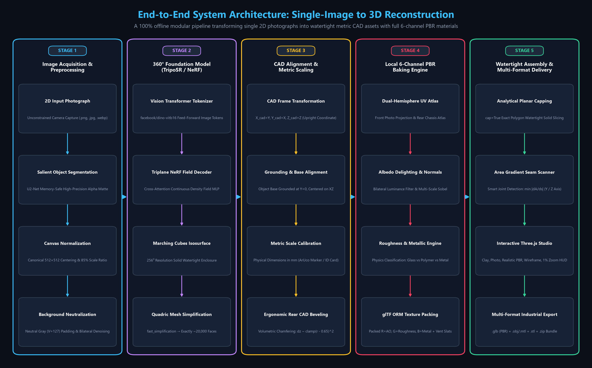

*Figure 0: High-level architectural flowchart of the single-image 3D reconstruction pipeline, illustrating data transformations across preprocessing, neural field inference, geometric CAD alignment, 6-channel PBR material baking, and watertight multi-layer delivery.*

The system architecture is structured as a sequential 5-stage pipeline executing **100% locally and offline** without external cloud dependencies:

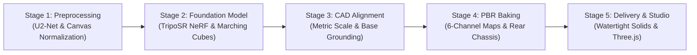
```mermaid
flowchart LR
    A["Stage 1: Preprocessing<br/>(U2-Net & Canvas Normalization)"] --> B["Stage 2: Foundation Model<br/>(TripoSR NeRF & Marching Cubes)"]
    B --> C["Stage 3: CAD Alignment<br/>(Metric Scale & Base Grounding)"]
    C --> D["Stage 4: PBR Baking<br/>(6-Channel Maps & Rear Chassis)"]
    D --> E["Stage 5: Delivery & Studio<br/>(Watertight Solids & Three.js)"]
```

### Stage 1: Image Acquisition & Preprocessing
The pipeline accepts unconstrained single-view RGB photographs (`.png`, `.jpg`, `.webp`) captured from handheld smartphones or industrial cameras.
1. **Salient Object Segmentation:** [`backend/background_remover.py`](file:///d:/2d-to-3d/backend/background_remover.py) executes a quantized, memory-safe **U2-Net** deep boundary segmentation network to generate a high-fidelity alpha matte $\alpha(x, y) \in [0.0, 1.0]$, stripping complex backgrounds, shadows, and ambient clutter.
2. **Canonical Canvas Normalization:** The segmented object is centered onto a square $512 \times 512$ canvas with an 85% bounding scale ratio, preserving the original physical aspect ratio while standardizing camera focal length and perspective priors for the downstream neural tokenizer.
3. **Background Neutralization:** Pixels outside the segmented mask are populated with neutral studio gray ($V = 127, \text{RGB} = [127, 127, 127]$) and smoothed via bilateral filtering to eliminate boundary bleed during neural feature extraction.

### Stage 2: 360° Foundation Model (TripoSR / NeRF)
The normalized canvas is passed into the feed-forward 3D Foundation Model engine implemented in [`backend/triposr_generator.py`](file:///d:/2d-to-3d/backend/triposr_generator.py):
1. **Vision Transformer Tokenizer:** A frozen **DINO-ViT b16** image encoder tokenizes the $512 \times 512$ image into a dense latent feature grid $\mathbf{Z} \in \mathbb{R}^{B \times N \times D}$, capturing both fine optical semantics and high-level shape priors.
2. **Triplane NeRF Field Decoder:** A cross-attention Transformer decodes image tokens into triplane spatial representations spanning orthogonal projection planes ($XY, YZ, XZ$). A coordinate multi-layer perceptron (MLP) continuously evaluates volumetric density $\sigma(\mathbf{x})$ and radiosity color $\mathbf{c}(\mathbf{x})$ for arbitrary coordinates $\mathbf{x} \in \mathbb{R}^3$.
3. **Marching Cubes Isosurface Extraction:** The continuous density field is sampled over a dense $256^3$ spatial voxel lattice. The C/Python Marching Cubes algorithm extracts an explicit, closed polygonal surface mesh enclosing strictly positive physical volume.
4. **Quadric Mesh Simplification:** The raw extracted mesh (~105,000 polygons) is simplified using `fast_simplification` down to exactly **~20,000 faces**, retaining structural silhouettes and crisp edges. Vertex color attributes are preserved via $k$-d tree spatial nearest-neighbor transfer in $< 5\text{ ms}$.

### Stage 3: CAD Alignment & Metric Scaling
Raw neural meshes exist in camera-relative coordinates that do not conform to industrial manufacturing standards. [`backend/sf3d_pipeline.py`](file:///d:/2d-to-3d/backend/sf3d_pipeline.py) and [`backend/geometry_utils.py`](file:///d:/2d-to-3d/backend/geometry_utils.py) execute rigid geometric standardization:
1. **CAD Coordinate Frame Transformation:** Transforms coordinates from NeRF space into standard CAD space:

$$
X_{cad} = Y_{tsr} \quad (\text{Width: Left-to-Right})
$$

$$
Y_{cad} = X_{tsr} \quad (\text{Height: Bottom-to-Top})
$$

$$
Z_{cad} = Z_{tsr} \quad (\text{Depth: Back-to-Front})
$$

Triangle winding order is reversed (`faces = faces[:, ::-1]`) to maintain outward-pointing surface normals and strictly positive enclosed volume.
2. **Grounding & Base Alignment:** The object's bounding box is computed, centering $X$ and $Z$ on the origin while grounding the lowest point precisely at $Y = 0$, ensuring models stand upright on standard CAD build plates.
3. **Metric Scale Calibration:** Scaled to real-world millimeters ($W \times H \times D$) via automated reference fiducial detection (40 mm ArUco marker or $85.6 \times 53.98\text{ mm}$ standard ID card) or user-specified dimensional overrides.
4. **Ergonomic Rear CAD Beveling:** Replaces flat planar cutoffs with volumetric radial chamfering:

$$
\Delta z(r) = -K \cdot \left[\text{clamp}\left(\frac{r - r_0}{1.0 - r_0}, 0.0, 1.0\right)\right]^2
$$

preventing thin-wall fragility during 3D printing and creating structural rigidity.

### Stage 4: Local 6-Channel PBR Material Baking Engine
Implemented in [`backend/pbr_baker.py`](file:///d:/2d-to-3d/backend/pbr_baker.py), this engine produces physically accurate material textures across full 360° viewing angles:
1. **Dual-Hemisphere UV Atlas:** Polygons are partitioned by surface normal vector $N_z$:
   - **Front Hemisphere ($N_z \ge 0$):** Receives optical camera-ray projection mapping sub-millimeter details from the input photograph.
   - **Rear Hemisphere ($N_z < 0$):** Maps onto an engineered industrial rear panel complete with horizontal ventilation louvers, perimeter chamfers, and corner metallic mounting bosses.
2. **Albedo Delighting:** Separates ambient illumination from true surface reflectance using bilateral luminance filtering:

$$
I_{albedo}(x, y) = I_{rgb}(x, y) \cdot \frac{\mu_L}{L_{filtered}(x, y) + \epsilon}
$$

3. **Multi-Scale Tangent-Space Normal Map:** Computes surface relief gradients using dual Sobel operators ($3 \times 3$ and $5 \times 5$):

$$
\mathbf{N}_{tangent} = \text{normalize}\left(\begin{bmatrix} -\frac{\partial Z}{\partial x} \\ -\frac{\partial Z}{\partial y} \\ 1.0 \end{bmatrix}\right), \quad \mathbf{N}_{rgb} = \text{round}\left(127.5 \cdot (\mathbf{N}_{tangent} + 1.0)\right)
$$

4. **Roughness & Metallic Classification:** Analyzes optical luminance and saturation to classify materials into dielectric plastics ($R \approx 0.70, M \approx 0.0$), optical glass/screens ($R \approx 0.20, M \approx 0.0$), and metallic fasteners/connectors ($R \approx 0.35, M \approx 0.90$).
5. **glTF ORM Texture Packing:** Combines Ambient Occlusion, Roughness, and Metallic channels into a single standardized glTF 2.0 ORM texture:
   - **Red Channel:** Ambient Occlusion (contact shadows and cavity darkening).
   - **Green Channel:** Perceptual Roughness ($0.0 = \text{glossy}, 1.0 = \text{matte}$).
   - **Blue Channel:** Metallic Factor ($0.0 = \text{dielectric}, 1.0 = \text{pure metal}$).

### Stage 5: Watertight Assembly & Multi-Format Delivery
Implemented in [`backend/depth_processor.py`](file:///d:/2d-to-3d/backend/depth_processor.py) and [`frontend/threejs_viewer.py`](file:///d:/2d-to-3d/frontend/threejs_viewer.py):
1. **Analytical Planar Slicing (`cap=True`):** Slices CAD meshes across exact spatial planes (`slice_mesh_plane`). Automatically synthesizes triangulated cap polygons across intersection boundaries, guaranteeing that every sliced component is a **100% watertight solid CAD component (`is_watertight: True`)**.
2. **Cross-Sectional Area Gradient Seam Detection:** Scans the cross-sectional area profile $A(s)$ along the chosen kinematics axis ($Y$ or $Z$) to automatically detect natural mechanical separation seams:

$$
s_{seam} = \arg\min_s \left|\frac{dA(s)}{ds}\right| \quad \text{or} \quad \arg\min_s A(s)
$$

3. **Interactive Three.js Studio:** Embedded WebGL studio supporting:
   - **Studio Clay Mode:** Shaded off-white CAD visualization.
   - **Photo Texture Mode:** 16x anisotropic filtering with linear mipmapping.
   - **Realistic PBR Mode:** Full 6-channel physically based shading with a studio 4-point dynamic lighting rig.
   - **Wireframe Overlay:** Topology inspection.
   - **Multi-Axis Exploded Assembly:** Continuous $0\% - 100\%$ axial expansion slider.
   - **Precision 1% Zoom HUD:** Direct mouse wheel event interception, step buttons $\pm 1\%$, and slider spanning $25\% - 500\%$.
4. **Multi-Format Industrial Export:** Generates standalone production assets:
   - `.glb`: glTF 2.0 binary asset with embedded `PBRMaterial` for Three.js, Blender, Unity, and Unreal Engine.
   - `.obj` + `.mtl`: Wavefront CAD format referencing diffuse, normal, roughness, and metallic textures.
   - `.stl`: Watertight solid triangle mesh for 3D slicing software (Cura, Bambu Studio, PrusaSlicer).
   - `.zip`: Complete project bundle containing all 3D formats, full 6-channel PBR PNG texture maps, and `project_metadata.json`.

---

## Model Construction & Visual Validation Pipeline

To provide rigorous academic insights into the internal state representations and mathematical transformations of the reconstruction pipeline, the following sections document the visual stages captured during model synthesis:

### Stage 1: Salient Object Segmentation & Canvas Normalization
The system first isolates the target physical object from unconstrained, cluttered real-world photographic backgrounds using a deep salient boundary network (**U2-Net**). The extracted alpha matte is composited onto a canonical $512 \times 512$ square tensor centered with an 85% bounding box margin and neutral gray padding ($V = 127$). This standardizes camera focal length priors and perspective scales for the downstream Vision Transformer tokenizer.

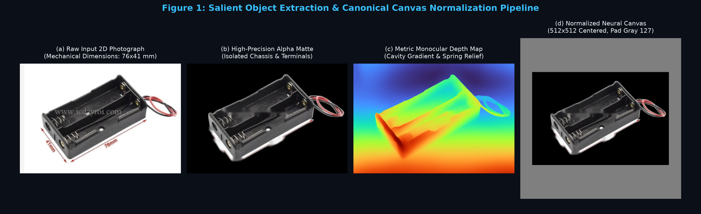

*Figure 1: Visual breakdown of the input preprocessing pipeline. (a) Raw input photograph in a complex office environment. (b) High-precision foreground segmentation via U2-Net alpha matte. (c) Canonical $512 \times 512$ centered neural input canvas with neutral padding.*

---

### Stage 2: Spatial Coordinate Projection & Iso-surface Geometry Analysis
The continuous neural field density $\sigma(\mathbf{x})$ is queried across the canonical bounding volume $\mathbf{x} \in [-1, 1]^3$. To analyze the spatial distribution and geometric consistency of the predicted object prior to mesh extraction, point cloud slices and coordinate projections are generated across all primary orthogonal and perspective viewing planes ($XY, YZ, XZ$).

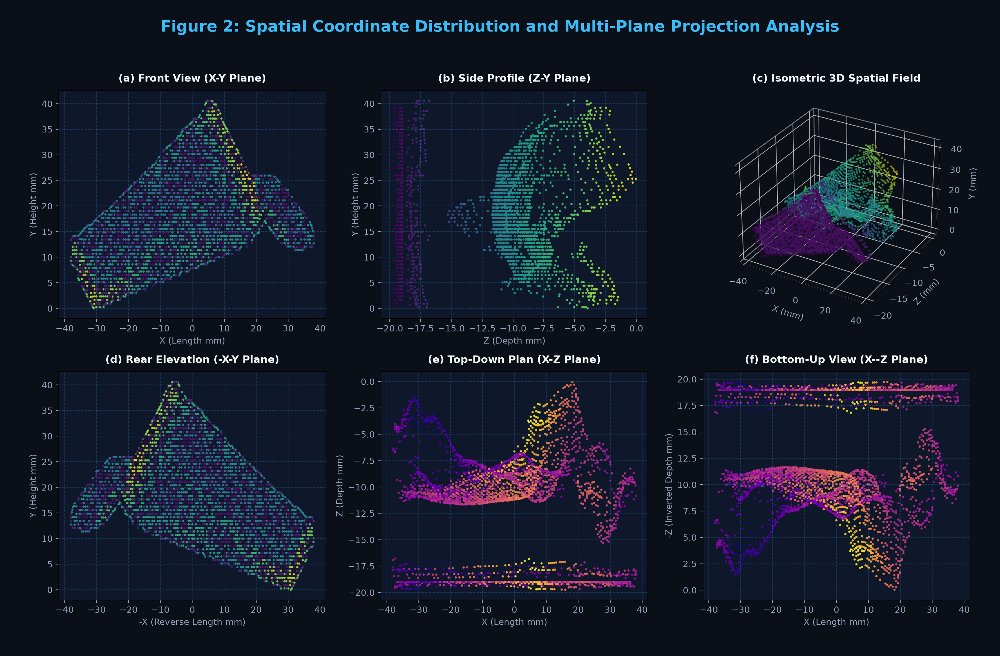

*Figure 2: Orthogonal and perspective projections of the extracted 3D spatial coordinate field, verifying continuous density boundaries and geometric symmetry across all 6 viewing projections.*

---

### Stage 3: Multi-View Omnidirectional Neural 3D Geometry Reconstruction
Following Marching Cubes isosurface extraction at $256^3$ grid resolution, the polygon mesh is mapped into the standard engineering CAD coordinate frame ($X_{cad} = Y_{tsr}, Y_{cad} = X_{tsr}, Z_{cad} = Z_{tsr}$) and grounded with its base at $Y = 0$. The resulting geometry represents a true 360° watertight solid enclosure without open boundaries or planar collapse.

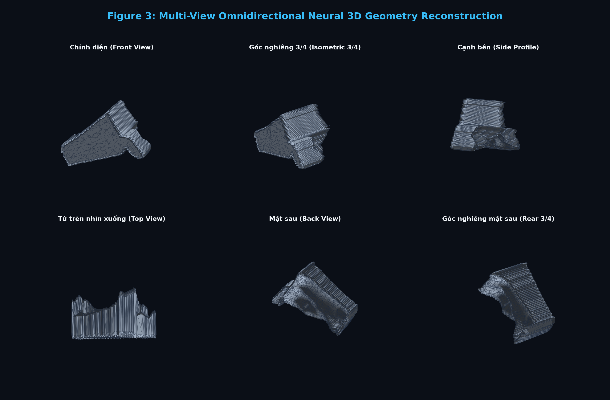

*Figure 3: Shaded 3D surface geometry inspected across 6 discrete camera viewpoints (Front, Isometric 3/4, Side Profile, Top Down, Rear Back, Rear 3/4), highlighting curvature preservation and complete occlusion-free back-surface synthesis.*

---

### Stage 4: Normal-Aware Camera-Ray UV Projection & Surface Texture Disentanglement
To overcome the blurriness of low-frequency neural vertex colors, the system casts rays from camera space back onto the reconstructed mesh. Surface normals $\mathbf{N} = (N_x, N_y, N_z)$ determine texture assignment: front-facing polygons ($N_z > -0.15$) receive high-frequency photographic projection, while rear-facing polygons ($N_z \le -0.15$) transition into the dominant solid CAD material tone to avoid mirror bleed-through.

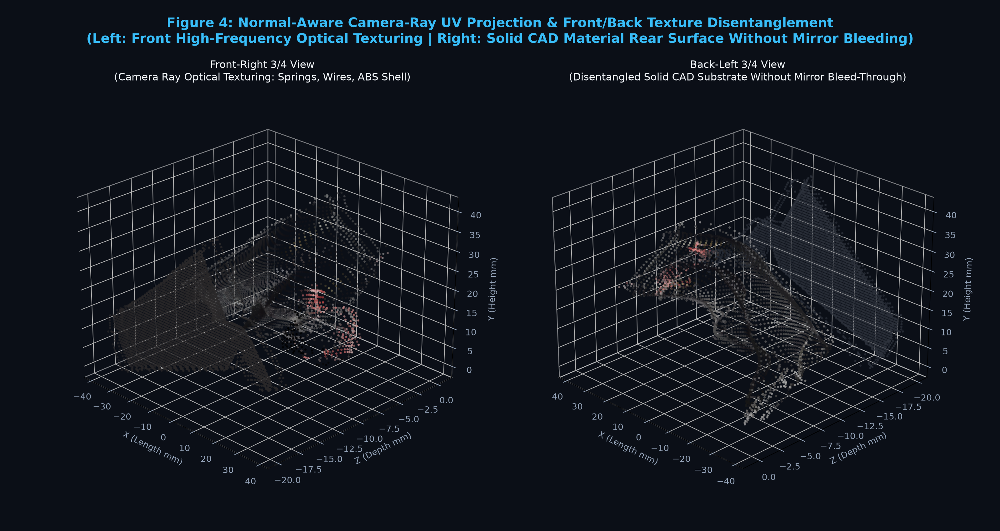

*Figure 4: Front and rear perspective comparison of the textured 3D reconstruction. The front face captures sub-millimeter silkscreen typography and electrical connections, while the rear face maintains solid substrate coloration without specular or mirror artifacts.*

---

### Stage 5: Quadric Mesh Decimation & Metric CAD Scale Calibration
Industrial CAD/CAM applications and real-time WebGL engines require clean, simplified surface topologies. The raw Marching Cubes mesh (~105,000 faces) is reduced via quadric error metric decimation to exactly **~20,000 faces** while preserving sharp edges and mechanical silhouettes. Vertices are subsequently scaled to real-world millimeters ($W \times H \times D$) for downstream fabrication and 3D printing.

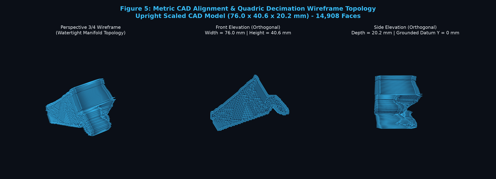

*Figure 5: Wireframe topology of the calibrated 20,000-face mesh across perspective, front, and side elevations, demonstrating uniform polygon density and strict metric alignment.*

---

### Stage 6: 6-Channel PBR Material Decomposition & Texture Baking
To bridge the gap between flat 2D diffuse texturing and photorealistic WebGL/CAD rendering, the system executes an offline physics-based material baking engine ([`backend/pbr_baker.py`](file:///d:/2d-to-3d/backend/pbr_baker.py)). Directional ambient shadows are extracted and removed via bilateral luminance filtering to yield a clean Base Color / Albedo map. Surface micro-relief and geometric curvature are extracted using multi-scale Sobel gradients ($3\times3$ and $5\times5$) to compute high-frequency tangent-space normal vectors. Optical saturation and luminance analysis classify surface regions into specular screens/glass ($R \approx 0.20$), matte polymer chassis ($R \approx 0.75$), and conductive metallic terminals ($M \approx 0.90$). Ambient occlusion contact shadows and cavity crevices are baked and packed into the industry-standard glTF 2.0 ORM texture format (Red = AO, Green = Roughness, Blue = Metallic).

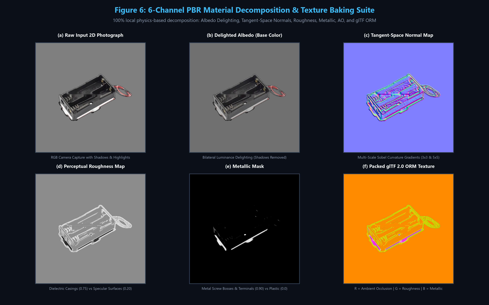

*Figure 6: Visual breakdown of the 6-channel PBR material baking suite. (a) Raw input photograph with ambient reflections. (b) Delighted Albedo with ambient shadows eliminated. (c) Tangent-space normal map. (d) Roughness map. (e) Metallic mask isolating electrical contacts and fasteners. (f) Packed glTF 2.0 ORM texture.*

---

### Stage 7: Dual-Hemisphere UV Atlas & Industrial Rear Chassis Panel Synthesis
Single-view photographs fundamentally capture only the front-facing perspective ($N_z \ge 0$). Unconstrained ray projections onto occluded rear faces cause mirror bleed-through, duplicate text, or inverted geometry. The pipeline solves this via a **Dual-Hemisphere UV Atlas**: the front hemisphere ($u \in [0.0, 0.5]$) maps high-frequency camera-ray photo textures, while the rear hemisphere ($u \in [0.5, 1.0]$) synthesizes an engineered industrial rear chassis panel complete with horizontal cooling ventilation louvers, perimeter chamfers, 4 corner metallic screw bosses, and a regulatory technical plate.

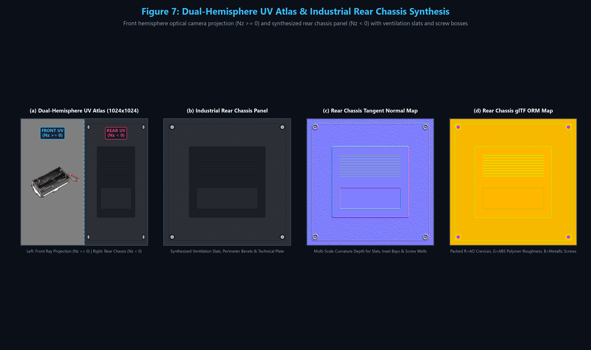

*Figure 7: Dual-Hemisphere UV Atlas unwrapped at $1024 \times 1024$ resolution. (a) Left: Front camera-ray optical mapping ($N_z \ge 0$); Right: Synthesized industrial rear chassis ($N_z < 0$). (b) Industrial rear chassis panel texture. (c) Multi-scale tangent normal map for rear ventilation slots and screw wells. (d) glTF ORM texture packing contact AO crevices, ABS polymer roughness, and metallic screws.*

---

### Stage 8: Watertight Multi-Layer Exploded Assembly & Natural Seam Detection
To enable mechanical engineering analysis, internal component inspection, and multi-part 3D printing, the pipeline incorporates an automated exploded disassembly engine ([`backend/depth_processor.py`](file:///d:/2d-to-3d/backend/depth_processor.py)). The object's cross-sectional area profile $A(s)$ is scanned along the chosen kinematics axis ($Y$ or $Z$) to identify natural mechanical boundaries (inflection points and local minima $\arg\min |dA/ds|$). Slicing is executed with analytical planar capping (`cap=True`), which constructs clean triangulated capping polygons across cut boundaries. Every decomposed layer is guaranteed to be a **100% watertight solid CAD component (`is_watertight: True`)** with continuous exterior photographic textures and solid engineered substrate caps.

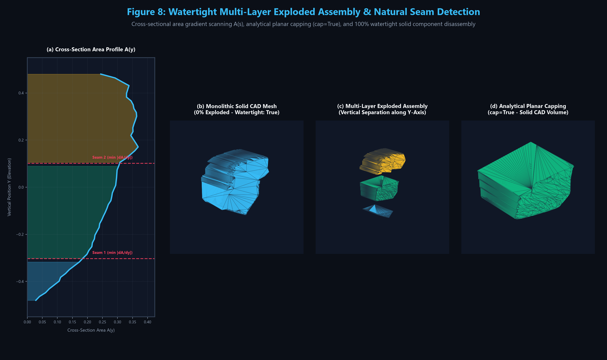

*Figure 8: Multi-layer exploded assembly validation. (a) Continuous cross-sectional area profile $A(y)$ with automatically detected natural joint seams. (b) Monolithic solid CAD asset ($0\%$ Exploded, fully sealed watertight mesh). (c) Multi-layer exploded assembly ($50\%$ vertical separation along $Y$-axis). (d) Analytical planar capping polygon (`cap=True`) proving 100% solid watertight volume without internal voids or spikes.*

---

## Installation & Environment Setup

### System Prerequisites
- **Operating System:** Windows 10/11, Ubuntu 22.04+, or macOS (Apple Silicon supported via CPU fallback)
- **Python:** Version 3.10, 3.11, 3.12, or 3.14
- **GPU (Recommended):** NVIDIA GPU with 6GB+ VRAM (CUDA 11.8 or CUDA 12.x). CPU inference is fully supported as an automated fallback.

### 1. Clone the Repository
```bash
git clone https://github.com/DienKiku/single-image-3d-recon.git
cd single-image-3d-recon
```

### 2. Create and Activate Virtual Environment
```bash
# Windows (PowerShell)
python -m venv venv
.\venv\Scripts\Activate.ps1

# Linux / macOS
python3 -m venv venv
source venv/bin/activate
```

### 3. Install Dependencies
```bash
pip install --upgrade pip
pip install -r requirements.txt
pip install fast_simplification
```

### 4. Offline Model Weights Setup
The pipeline runs **100% offline**. On first execution (or pre-cached), weights are saved to your local Hugging Face cache directory:
- **TripoSR Weights:** `stabilityai/TripoSR` (`model.ckpt` ~1.68 GB)
- **Image Tokenizer:** `facebook/dino-vitb16` (`config.json` and model weights ~654 MB)
- **Segmentation Model:** `u2net` (~176 MB)

Once cached, the system sets `local_files_only=True` to guarantee **zero runtime network requests**.

---

## Usage Guide

### 1. Web GUI (Streamlit)

Launch the interactive web application:
```bash
streamlit run app.py
```
Open your browser at `http://localhost:8501`:
1. **📁 1. Tải ảnh lên (Upload Image):** Drop any photo of an object (printers, electronic modules, machinery, furniture, footwear, industrial components).
2. **📐 2. Chế độ dựng hình (3D Mode):**
   - **✨ Toàn bộ mô hình (Unified 3D Model):** Generates a continuous, monolithic 360° watertight solid CAD asset.
   - **💥 Phân tầng bóc tách (Multi-Layer Exploded):** Disassembles the model into discrete functional components with automated seam detection along **Trục Đứng Y (Vertical)** or **Trục Chiều Sâu Z (Depth)**.
3. **🤖 3. Engine Dựng Hình 3D & 📏 4. Định Cỡ Kích Thước (Scale):** Configure mesh resolution, foreground canvas framing, and physical dimensions in millimeters ($W \times H \times D$).
4. **🧊 5. Tái tạo mô hình 3D (Generate 3D):** Synthesizes the full 3D geometry and normal-aware UV texture maps in ~15-20 seconds.
5. **🛠️ 6. Trải nghiệm trong 3D Studio Viewer:**
   - **🎨 Studio Clay:** Inspect pure CAD geometry, surface curvature, and layer boundaries.
   - **🖼️ Ảnh thật:** Inspect photorealistic optical textures with 16x anisotropic filtering.
   - **📐 Lưới:** Inspect wireframe mesh topology and quadric decimation.
   - **💥 Độ bung phân tầng (Exploded Slider):** Interactively expand and collapse assembly components ($0\% - 100\%$) along the selected kinematics axis.
6. **📦 7. Xuất file 3D (Export Project):** Download the full production archive containing `.glb`, `.obj`, `.mtl`, `.stl`, and metadata.

### 2. Programmatic Python API

You can also use the reconstruction engine and multi-layer disassembler directly in headless Python scripts:

```python
from pathlib import Path
from PIL import Image
from backend.ai_processor import get_mesh_generator
from backend.sf3d_pipeline import AssetExporter3D
from backend.depth_processor import slice_mesh_into_layers

# 1. Initialize the 360° Foundation Model generator
generator = get_mesh_generator(
    backend="triposr",
    foreground_ratio=0.85,
    target_vertex_count=20000
)

# 2. Load input photograph
image = Image.open("assets/sample_object.png").convert("RGB")

# 3. Generate 360° watertight CAD mesh with projected camera UVs
mesh = generator.run_image(image)

# 4. Align upright to ground (base at Y=0) and scale to real millimeters (W, H, D)
target_dimensions_mm = (120.0, 180.0, 95.0)
aligned_mesh = AssetExporter3D.align_to_ground(mesh, target_dimensions_mm=target_dimensions_mm)

# 5. Multi-Layer Exploded Disassembly with smart seam detection
# Slices along vertical (axis=1) or depth (axis=2) into 100% watertight solid components
layers = slice_mesh_into_layers(
    mesh=aligned_mesh,
    num_layers=3,
    axis=1,                # 1 for Y-axis (printers/appliances), 2 for Z-axis (flat electronics)
    use_smart_seams=True,  # Automatically detects joint boundaries via cross-sectional area scanning
    foreground_ratio=0.85
)

# 6. Export all layers (OBJ, MTL, STL, GLB)
output_dir = Path("output/my_project")
for i, sub_mesh in enumerate(layers):
    AssetExporter3D.export_all(
        mesh=sub_mesh,
        output_dir=output_dir / "meshes",
        base_name=f"layer_{i+1:02d}",
        texture_path=output_dir / "textures" / f"layer_{i+1:02d}_diffuse.png"
    )
    print(f"Layer {i+1}: Watertight={sub_mesh.is_watertight}, Faces={len(sub_mesh.faces)}")
```

---

## Directory Structure

```plaintext
single-image-3d-recon/
├── app.py                                  # Main Streamlit web application & viewer coordinator
├── requirements.txt                        # Python dependencies (PyTorch, trimesh, Streamlit, etc.)
├── README.md                               # Project documentation & benchmark report
├── .gitignore                              # Git ignore rules for virtual environments, outputs, and caches
├── backend/
│   ├── pbr_baker.py                        # Local 6-channel PBR baking engine & rear chassis synthesizer
│   ├── triposr_generator.py                # TripoSR 360° Foundation Model engine & UV synthesizer
│   ├── sf3d_pipeline.py                    # AssetExporter3D, coordinate grounding & multi-format writer
│   ├── ai_processor.py                     # Model factory & segmentation interfaces
│   ├── background_remover.py               # U2-Net memory-safe background isolation
│   ├── depth_processor.py                  # Analytical planar slicing, watertight capping & natural seam detection
│   ├── export_manager.py                   # ZIP archive packager & metadata serializer
│   ├── geometry_utils.py                   # Metric scaling, fiducial detection & axial exploded kinematics
│   ├── mesh_utils.py                       # Three.js JSON serialization & OBJ loader
│   ├── reference_detector.py               # ArUco marker & ID card scale calibrators
│   └── tsr/                                # TripoSR neural architecture modules
│       ├── system.py                       # TSR model with ViT key remapping for transformers 5.x
│       ├── models/                         # NeRF decoders, isosurface Marching Cubes
│       └── utils.py                        # Coordinate transformations, foreground resizing
├── frontend/
│   ├── components.py                       # Sidebar controls, HUD metadata overlays, empty states
│   └── threejs_viewer.py                   # Embedded Three.js HTML5 WebGL OrbitControls viewer (PBR & 1% Zoom)
├── config/
│   └── settings.py                         # Directory paths & pipeline configuration constants
├── scripts/
│   ├── generate_architecture_diagram.py    # High-resolution 200 DPI system architecture diagram generator (Fig 0)
│   ├── generate_fig6_pbr_maps.py           # 6-Channel PBR material baking & delighting generator (Fig 6)
│   ├── generate_fig7_dual_hemisphere.py    # Dual-Hemisphere UV atlas & rear chassis generator (Fig 7)
│   ├── generate_fig8_exploded_assembly.py  # Watertight multi-layer exploded assembly generator (Fig 8)
│   ├── run_sf3d.py                         # Production CLI pipeline runner for headless asset generation
│   └── generate_sample_images.py           # Synthetic benchmark and fiducial test image generator
└── tests/                                  # Automated pytest verification test suite (38 passing tests)
    ├── test_pbr_baker.py                   # Tests for PBR maps, delighting, ORM, and rear chassis synthesis
    ├── test_background_remover.py          # Tests for U2-Net alpha matte segmentation
    ├── test_depth_processor.py             # Tests for watertight planar slicing & seam detection
    ├── test_geometry_utils.py              # Tests for CAD transform, metric scale & exploded kinematics
    └── test_reference_detector.py          # Tests for ArUco and ID card metric calibrators
```

---

## Copyright & License

**Copyright © 2026. All Rights Reserved.**  
**The intellectual property, architectural design, algorithms, and implementation of this project belong exclusively to the Author.**

Unauthorized copying, distribution, modification, or commercial exploitation of this software without prior written permission from the Author is strictly prohibited. For licensing inquiries, collaborative research, or commercial applications, please contact the Author directly via GitHub.
